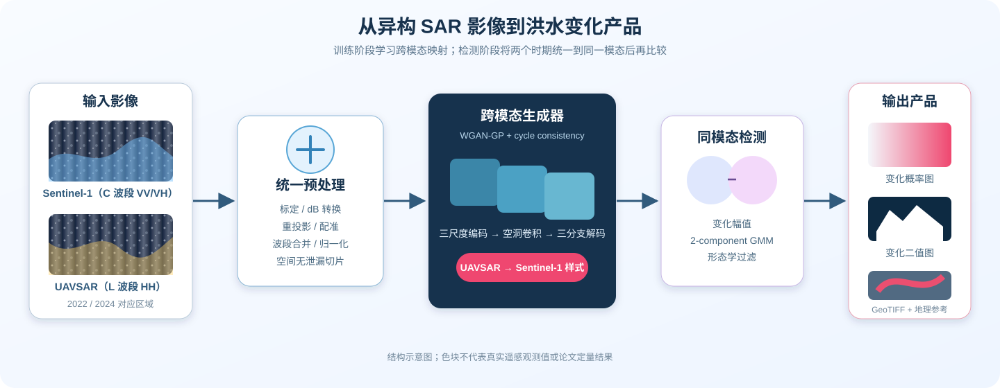
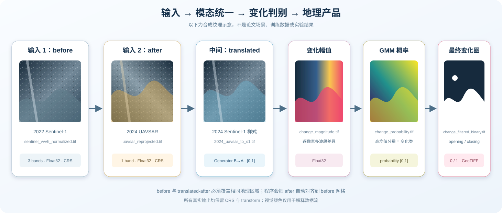
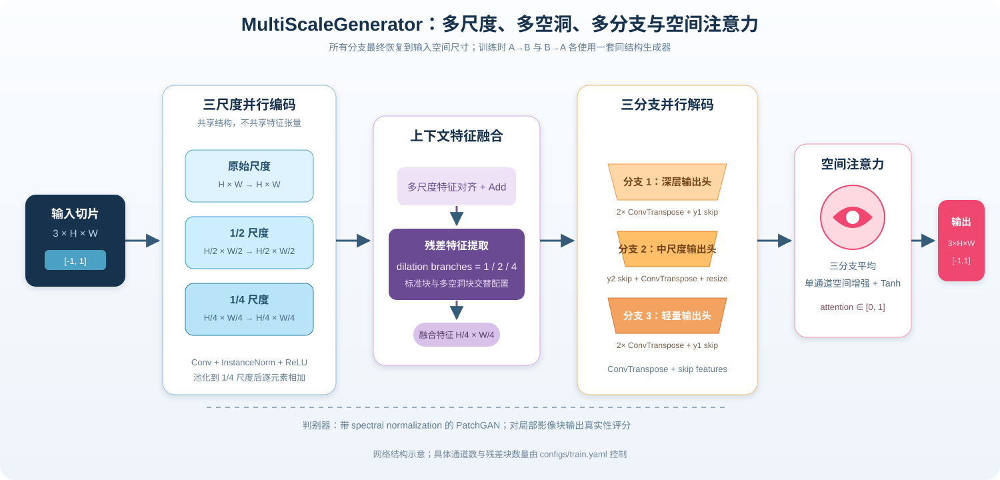
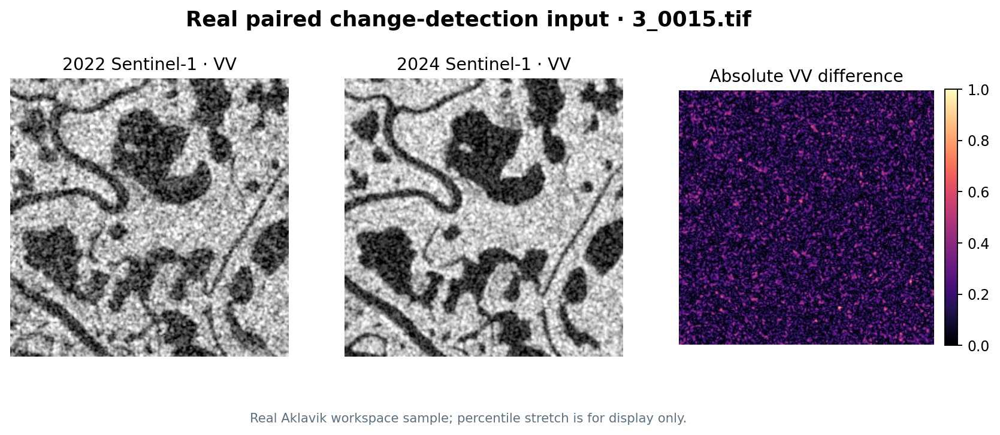
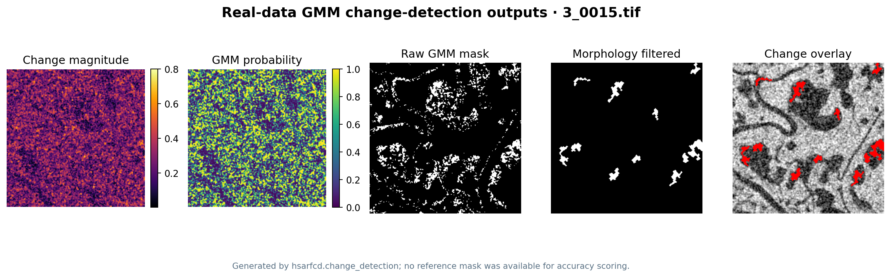
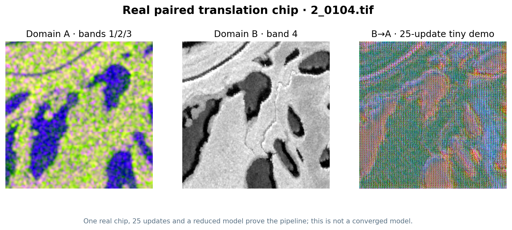

# Heterogeneous SAR Flood Change Detection

可复现的异构 SAR 洪水变化检测代码

本仓库只包含复现代码、配置和数据清单，**不包含数据集或训练权重**。

## 方法概览



流程分为两个阶段：首先利用双向 WGAN-GP 和 cycle-consistency 学习 Sentinel-1 与 UAVSAR 的跨模态映射；随后将两个时期统一为相同模态，计算变化幅值，再通过两分量 GMM 和形态学处理得到洪水变化产品。

## 输入与输出



> 图中的影像纹理是合成示意，不是论文数据或实验结果。仓库不包含任何真实遥感影像。

训练模型时，输入是空间配准且文件名一一对应的切片：

| 输入 | 默认含义 | 波段与数值 | 配置位置 |
| --- | --- | --- | --- |
| Domain A | Sentinel-1 样式切片 | 默认读取 1、2、3 波段，归一化至 `[-1,1]` | `dataset.*.domain_a`、`bands_a` |
| Domain B | UAVSAR 样式切片 | 默认读取第 1 波段并重复为三通道，归一化至 `[-1,1]` | `dataset.*.domain_b`、`bands_b` |

执行洪水变化检测时，需要以下两张同区域影像：

| 检测输入 | 示例 | 作用 |
| --- | --- | --- |
| `before` | 2022 Sentinel-1 归一化影像 | 变化检测参考时期和目标网格 |
| `after` | 2024 UAVSAR 经 `B_to_A` 转换后的 Sentinel-1 样式影像 | 自动重投影到 `before` 网格后参与差分 |

主要输出均保留 GeoTIFF 的 CRS 和 transform：

| 输出文件 | 数据类型 | 内容 |
| --- | --- | --- |
| `2024_uavsar_to_s1.tif` | 3-band Float32，`[0,1]` | 大图分块转换与 Hann 加权拼接结果 |
| `change_magnitude.tif` | 1-band Float32 | 两个时期的多波段变化幅值 |
| `change_probability.tif` | 1-band Float32，`[0,1]` | 像素属于 GMM 高均值变化分量的概率 |
| `change_raw_binary.tif` | 1-band UInt8 | GMM 原始变化分类，值为 0/1 |
| `change_filtered_binary.tif` | 1-band UInt8 | 形态学处理后的最终变化图，值为 0/1 |
| `change_map.tif` | 3-band UInt8 | 在参考影像上以红色标记变化区域的展示图 |
| `gmm_parameters.npz` | NumPy archive | GMM 均值、协方差、权重和变化分量编号 |

## 模型内部结构



生成器接收 `3×H×W` 张量，分别在原始、1/2 和 1/4 尺度提取特征。三组特征通过池化对齐到 1/4 尺度并逐元素相加，随后进入包含 dilation 为 1、2、4 并行卷积的残差模块。三个解码分支以不同深度和 skip connection 恢复空间细节；空间注意力模块学习单通道位置增强系数，对三分支平均结果进行调制，最终通过 `Tanh` 输出 `3×H×W` 的转换影像。

训练阶段同时建立 `G_AB` 和 `G_BA` 两个同结构生成器，以及两个带 spectral normalization 的 PatchGAN 判别器。判别器负责局部真实性约束，cycle loss 约束往返转换后仍保留原始地物结构。

## 真实数据随机测试

为了验证仓库不只对合成测试数据有效，我在原工作区的 Aklavik 洪水数据中使用固定随机种子 `42` 抽样。主测试从 70 组 2022/2024 同名 Sentinel-1 切片中抽中 `3_0015.tif`；模型链路另从 484 个四波段跨模态切片中抽中 `2_0104.tif`。完整路径、命令、参数和限制见 [真实样本运行记录](docs/REAL_SAMPLE_DEMO.md)。

### 两个时期的真实输入



两张影像均为 256×256 Float32 GeoTIFF、EPSG:32608。程序将 2024 影像重投影到 2022 网格后计算三波段变化幅值；图中灰度和差分颜色只做百分位拉伸显示，不改变算法输入。

### GMM 与形态学处理结果



本次运行使用两分量 GMM、低后向散射水体约束、opening/closing 和小目标过滤。结果从 6,889 个原始候选像元保留 2,156 个像元，占切片 3.290%，形成 11 个连通区域，按栅格分辨率折算约 0.2145 km²。

> 该切片没有人工参考变化掩膜，因此这里不报告 Precision、F1 或 IoU。上述比例和面积只是算法输出描述，不能视为精度、官方洪水范围或论文定量结果。

### 跨模态模型真实切片冒烟测试



历史四波段切片被明确拆为 A = 第 1–3 波段、B = 第 4 波段。测试完成了数据拆分、校验、25 次轻量 CPU 参数更新、checkpoint 保存/加载和 B→A 分块推理。展示中的条纹和色彩伪影说明小样本模型尚未收敛；这张图用于证明软件链路，而不是替代完整数据训练结果。

## 代码包含什么

- GeoTIFF 读取、重投影对齐、SAR power→dB、波段合并和归一化；
- 保留地理参考的成对切片；
- 论文描述的多尺度、多空洞卷积、多分支、空间注意力生成器；
- DualGAN 风格双向 WGAN-GP 训练与 cycle-consistency loss；
- 完整 checkpoint、断点续训、固定随机种子和训练指标 JSONL；
- 对大幅 GeoTIFF 的重叠分块推理与加权拼接；
- 两分量 Gaussian Mixture Model 变化分类；
- opening、closing、小目标和小孔洞过滤；
- Precision、Recall、F1、IoU、OA 和 Kappa 评估；
- 不依赖真实数据的单元测试。

## 安装

推荐使用 Conda：

```bash
conda env create -f environment.yml
conda activate hsarfcd
pip install -e .
```

或在已有 Python 3.10+ 环境中：

```bash
pip install -e .
```

开发和测试：

```bash
pip install -e '.[dev]'
pytest -q
```

## 数据准备

数据不随仓库发布。首先复制路径模板：

```bash
cp configs/data.example.yaml configs/data.local.yaml
```

然后把 `configs/data.local.yaml` 中的 `/path/to/...` 改为本机路径。研究使用的数据类型与场景 ID 见 [data/README.md](data/README.md)，清单模板见 [data/manifest.example.csv](data/manifest.example.csv)。

配置完成后，可先检查目录、A/B 文件名、波段、尺寸和坐标参考：

```bash
hsarfcd-validate --data-config configs/data.local.yaml \
  --output outputs/dataset_validation.json
```

训练数据应整理为：

```text
/path/to/hsarfcd-data/
└── translation/
    ├── train/
    │   ├── A/               # Sentinel-1 样式
    │   └── B/               # UAVSAR 样式
    ├── val/
    │   ├── A/
    │   └── B/
    └── test/
        ├── A/
        └── B/
```

A/B 必须使用完全相同的文件名，如 `tile_00001.tif`。默认读取 A 的第 1–3 波段、B 的第 1 波段，并将单波段重复成三通道。可在数据配置中修改。

### 预处理命令

SAR power 转 dB：

```bash
hsarfcd-prepare db input_power.tif output_db.tif
```

将不同栅格对齐到第一个输入并合并波段：

```bash
hsarfcd-prepare stack sentinel_vvvh.tif sentinel_vv.tif sentinel_vh.tif
```

原工作区的历史切片将 A/B 合并在一个四波段 GeoTIFF 中，可显式拆成配对目录。前三波段作为 Sentinel-1 样式 A，第 4 波段作为 UAVSAR 样式 B：

```bash
hsarfcd-prepare split-combined combined_4band.tif \
  /path/to/translation/train/A/tile_00001.tif \
  /path/to/translation/train/B/tile_00001.tif \
  --bands-a 1 2 3 --bands-b 4
```

百分位归一化到 `[-1, 1]`：

```bash
hsarfcd-prepare normalize input.tif normalized.tif --lower 1 --upper 99
```

对已经配准的 A/B 影像切成 256×256 样本：

```bash
hsarfcd-prepare tile-pair \
  sentinel_style.tif uavsar_style.tif /path/to/hsarfcd-data/translation \
  --split train --tile-size 256 --stride 256
```

> 数据拆分应按空间区域完成，再切片或确保各 split 无空间重叠，避免相邻像素泄漏到验证/测试集。

## 训练跨模态转换模型

```bash
hsarfcd-train \
  --data-config configs/data.local.yaml \
  --train-config configs/train.yaml
```

默认配置复现原实验的主要参数：300 epochs、batch size 8、Adam `2e-4`、`β=(0.5,0.999)`、每 5 个 discriminator step 更新一次 generator、`λcycle=10`、`λgp=10`。

输出：

```text
runs/paper_model/
├── resolved_config.json
├── metrics.jsonl
├── samples/
└── checkpoints/
    ├── epoch_0010.pt
    └── latest.pt
```

断点续训时修改 `configs/train.yaml` 的 `resume`，或复制一份本地配置后修改。

## 全景转换

编辑 `configs/inference.yaml` 的 checkpoint、input、output 和 direction：

- `A_to_B`：Sentinel-1 → UAVSAR；
- `B_to_A`：UAVSAR → Sentinel-1，洪水检测推荐方向。

然后运行：

```bash
hsarfcd-translate --config configs/inference.yaml
```

推理使用重叠切片和 Hann 权重拼接，输出是保留 CRS/transform 的 Float32 GeoTIFF，数值范围为 `[0,1]`。大图的累计数组使用临时磁盘映射文件，避免完全驻留内存。

## GMM 洪水变化检测

变化检测的两张输入必须表示相同模态和地理区域。`after` 会自动重投影到 `before` 网格。

```bash
hsarfcd-detect --config configs/change_detection.yaml
```

输出：

```text
outputs/change_detection/
├── change_magnitude.tif
├── change_probability.tif
├── change_raw_binary.tif
├── change_filtered_binary.tif
├── change_map.tif
└── gmm_parameters.npz
```

GMM 中均值最大的分量被解释为变化类。默认不施加水体掩膜；如果实验需要只保留低后向散射水体区域，可在配置中启用 `water_mask.enabled`。

## 评估

```bash
hsarfcd-evaluate \
  /path/to/reference_change_mask.tif \
  outputs/change_detection/change_filtered_binary.tif \
  --output outputs/change_detection/metrics.json
```

预测会用 nearest-neighbor 重投影到标签网格。

## 仓库结构

```text
.
├── configs/                  # 路径、训练、推理和变化检测模板
├── data/                     # 只有数据说明与 manifest 模板
├── docs/                     # 架构图、复现边界、来源和迁移映射
│   └── images/               # README 使用的 SVG 示意图
├── scripts/                  # Python CLI 包装器
├── src/hsarfcd/
│   ├── change_detection.py
│   ├── config.py
│   ├── dataset.py
│   ├── inference.py
│   ├── metrics.py
│   ├── models.py
│   ├── preprocess.py
│   ├── raster.py
│   ├── train.py
│   ├── utils.py
│   └── validate.py
└── tests/
```

## 复现状态与已知边界

原工作区保留的 `models.py` 同时包含基础 U-Net（当前启用）和被注释的论文最终结构；原 `change_detection.ipynb` 主要保留了 Otsu 阈值实验，而论文摘要明确写 GMM。本仓库依据论文描述和定稿前代码草稿，将论文网络变成可执行实现并恢复 GMM 流程。因此：

- 本仓库可从头训练和执行完整论文方法；
- 旧 `.pth` 由另一份当时启用的模型定义生成，**不保证与本仓库网络结构兼容**；
- 在没有论文定稿时精确 commit、最终数据 split 与 GMM 参数记录的情况下，无法保证逐像素重现论文表格；
- 已知差异、参数来源和验证清单详见 [docs/REPRODUCIBILITY.md](docs/REPRODUCIBILITY.md)。

## 许可证与数据

代码使用 MIT License，派生来源见 [NOTICE.md](NOTICE.md)。本许可证不授予任何数据集的再分发权。发布或分享 Sentinel-1、UAVSAR、COSMO-SkyMed 或其他遥感产品前，请分别确认提供方条款。
